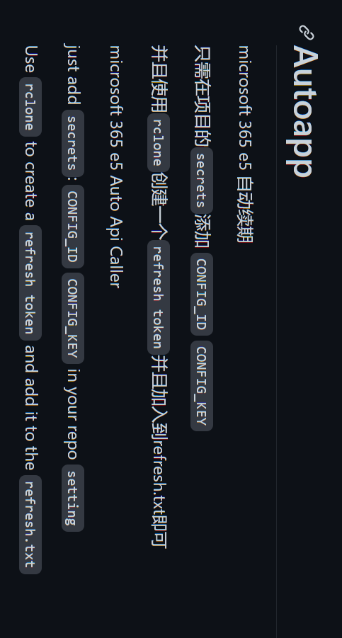

横过来看

Read the word on the phone upside down

## Environment variables

| Variable | Required | Description |
| --- | --- | --- |
| `CONFIG_ID` | Yes | Application (client) ID |
| `CONFIG_KEY` | Yes | Application client secret |
| `TENANT_ID` | No | Tenant ID (GUID) or domain, e.g. `contoso.onmicrosoft.com`. Unset or blank falls back to `common` (multi-tenant) |

A single-tenant app must set `TENANT_ID` to its own tenant; refreshing a token against `common` otherwise fails with `AADSTS50194`.
The matching GitHub Actions secret names are `CONFIG_ID`, `CONFIG_KEY` and `TENANT_ID` (an unset secret is empty, which falls back to `common`).
